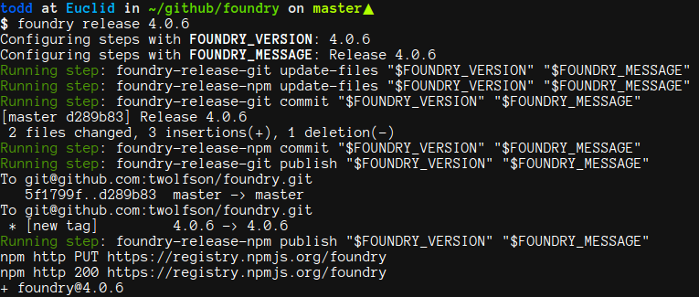

# foundry [](https://travis-ci.org/twolfson/foundry)

// TODO: Update screenshot
// TODO: Build `foundry resume`
- Resumable releases in case of issues (e.g. repository is having issues, never set up username/password)
    - TODO: Link to `foundry resume` documentation
// TODO: Replace `plugin` with `command`
// TODO: Test in Appveyor (Windows support)
// TODO: Add --dry-run to `release`
// TODO: Build `foundry-cli`

Release manager for [npm][], [bower][], [component][], [PyPI][], [git tags][], and any command you want.

[npm]: http://npmjs.org/
[bower]: http://bower.io/
[component]: http://component.io/
[PyPI]: http://pypi.python.org/
[git tags]: http://git-scm.com/

This was created out of frustration; there was no generic *sharable* release manager.

**Features:**

- Well tested release library as well as commands
- Specification is CLI based, allowing for any language implementation
    - https://github.com/twolfson/foundry-release-spec
- Transparent output; always know what commands are being executed



## Getting Started
Install the module via: `npm install foundry`

By default, `foundry` is not configured with any release commands. Install a release command via `npm`:

```bash
npm install foundry-release-bower  # bower
npm install foundry-release-component  # component.io
npm install foundry-release-git  # git
npm install foundry-release-npm  # npm
npm install foundry-release-pypi  # PyPI
```

Details about existing commands and their documentation can be found under the [Commands](#commands) heading.

For example purposes, we will create/release on a local-only `git` repository.

```bash
# Install a `git` foundry-release command
npm install foundry-release-git

# Create git repo
mkdir foundry-example
cd foundry-example
git init
echo "Hello World" > README.md
git add README.md
git commit -m "Added documentation"

# Generate `package.json` with `foundry` config
cat > package.json <<EOF
{
  "foundry": {
    "releaseCommands": [
      "foundry-release-git"
    ]
  }
}
EOF

# Run our release
#   Prepending `./node_modules/.bin/` to `PATH` can be avoided by using `foundry-cli`
#   https://github.com/twolfson/foundry-cli
#   or by using `npm-run-script`
#   https://www.npmjs.org/doc/misc/npm-scripts.html#environment
PATH="$PATH:./node_modules/.bin/foundry"
foundry release 1.0.0
# [master c6ce921] Release 1.0.0

# See the release commit and tag
git log --decorate --oneline
# c6ce921 (HEAD, tag: 1.0.0, master) Release 1.0.0
# f0c25b3 Added documentation
```

## Documentation
`foundry` provides a command line interface for releasing.

```bash
$ foundry --help

  Usage: foundry [options] [command]

  Commands:

    release <version>      Update package metadata and publish to registries
    commands               List commands used by current package
    completion             Get potential completions for a command. Looks for `COMP_CWORD`, `COMP_LINE`, `COMP_POINT`.

  Options:

    -h, --help     output usage information
    -V, --version  output the version number

```

Example releases are:

```bash
foundry release 1.0.0
foundry release 1.1.0
foundry release 2.0.0
```

> Commands that automatically increment semver are planned (e.g. `foundry release major`, `foundry release minor`). See https://github.com/twolfson/foundry/issues/16 for more information.

### Release process

When a release occurs, the following steps are processed:

1. Update files, update package files with the new version and changes (e.g. update `package.json`, add to `CHANGELOG.md`)
2. Commit, persist any changes to a version control system (e.g. `git commit && git tag`)
3. Register, if the package is new (semver === `1.0.0`), then register it to its repository (e.g. `python setup.py register`)
4. Publish, release changes to package's repostiroy manager (e.g. `npm publish`)

### Commands
`foundry` release commands contain the `foundry-release` keyword and adhered to the `foundry` release command specification:

https://github.com/twolfson/foundry-release-spec

Existing commands are:

- [foundry-release-bower][], manages `version` in `bower.json`
- [foundry-release-component][], manages `version` in `component.json`
- [foundry-release-git][], runs `git tag` and `git commit` upon release
- [foundry-release-npm][], manages `version` in `package.json` and runs `npm publish` upon release
- [foundry-release-pypi][], manages `version` in `setup.py` and registers/zips/gzips package upon release
- More commands can be found at https://www.npmjs.org/browse/keyword/foundry-release

[foundry-release-bower]: https://github.com/twolfson/foundry-release-bower
[foundry-release-component]: https://github.com/twolfson/foundry-release-component
[foundry-release-git]: https://github.com/twolfson/foundry-release-git
[foundry-release-npm]: https://github.com/twolfson/foundry-release-npm
[foundry-release-pypi]: https://github.com/twolfson/foundry-release-pypi

## Contributing
In lieu of a formal styleguide, take care to maintain the existing coding style. Add unit tests for any new or changed functionality. Lint via [grunt](https://github.com/gruntjs/grunt) and test via `npm test`.

## Donating
Support this project and [others by twolfson][gittip] via [gittip][].

[![Support via Gittip][gittip-badge]][gittip]

[gittip-badge]: https://rawgithub.com/twolfson/gittip-badge/master/dist/gittip.png
[gittip]: https://www.gittip.com/twolfson/

## Unlicense
As of Dec 07 2013, Todd Wolfson has released this repository and its contents to the public domain.

It has been released under the [UNLICENSE][].

[UNLICENSE]: UNLICENSE
